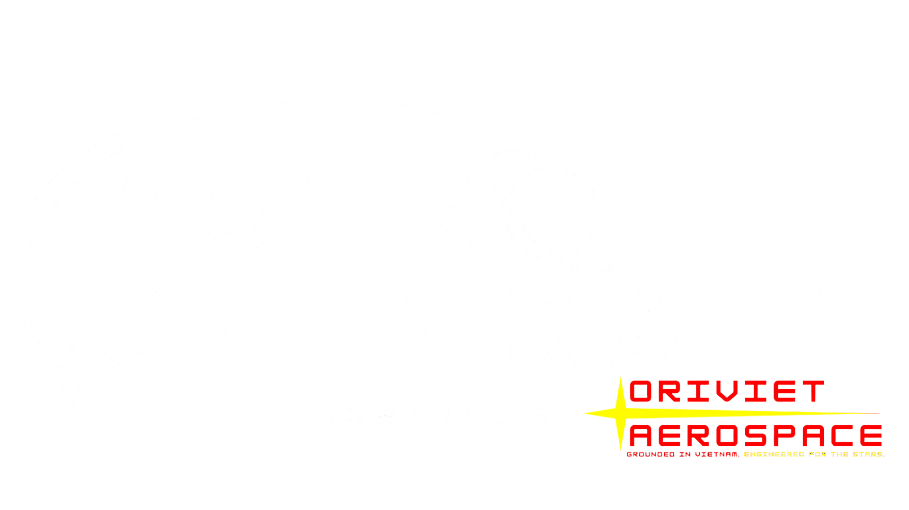

> [!NOTE]
> This README is in Vietnamese. The English README can be read [here](README-EN.md).

    
    
Bản quyền © 2024-2025 <a href="https://www.linkedin.com/in/minhduong-thechosenone/">Dương Duy Nhật Minh</a>, kinh doanh dưới tên <b>Hàng không Vũ trụ Oriviet</b>. Mọi quyền được bảo lưu.

     

<<<<<<< HEAD
Đây là kho lưu trữ công khai của Astrocelerate, công cụ mô phỏng cơ học quỹ đạo và chuyến bay vũ trụ. Dự án được phát triển bởi người Việt cho người Việt, trong công cuộc xây dựng nền móng tự chủ công nghệ của quốc gia.
Để biết thêm thông tin chi tiết về mục tiêu, tính năng và triết lý thiết kế của dự án, vui lòng tham khảo README này.
=======

This is the public-facing repository of Astrocelerate, Vietnam's first ever orbital mechanics and spaceflight simulation engine, built to deliver sovereign aerospace capability through high-fidelity physics, Vulkan rendering, and modular C++ extensibility.
For more detailed information about the project's goals, features, and design philosophy, please refer to this README.
>>>>>>> c06336215027b49c955eb51378bfd677af6772c6

> [!NOTE]
> Mã nguồn của Astrocelerate hiện đang được duy trì trong một kho lưu trữ riêng tư để bảo vệ sở hữu trí tuệ cho mục đích học thuật.
> Tuy nhiên, bạn vẫn có thể xem tiến độ của Astrocelerate thông qua phần [Kho ảnh](#kho-ảnh).

---

# Mục lục
* [Giới thiệu](#giới-thiệu)
    * [Mục tiêu](#mục-tiêu)
    * [Tầm nhìn](#tầm-nhìn)
        * [Tầm nhìn ngắn hạn (MVP)](#tầm-nhìn-ngắn-hạn-mvp)
    * [Triết lý thiết kế](#triết-lý-thiết-kế)
* [Tính năng](#tính-năng)
    * [Đã triển khai](#đã-triển-khai)
    * [Sắp có](#sắp-có)
* [Cài đặt](#cài-đặt)
    * [Phần mềm thiết yếu](#phần-mềm-thiết-yếu)
    * [Cài đặt lần đầu](#cài-đặt-lần-đầu)
* [Lịch sử](#lịch-sử)
    * [Kho ảnh](#kho-ảnh)

---

<<<<<<< HEAD
# Giới thiệu
Astrocelerate là công cụ mô phỏng cơ học quỹ đạo và chuyến bay vũ trụ hiệu suất cao đầu tiên được phát triển tại Việt Nam, nhằm nâng cao năng lực quốc gia và tiềm lực khoa học - công nghệ trong lĩnh vực Hàng không Vũ trụ và Thiên văn học.

## Mục tiêu
Được phát triển bằng C++ với pipeline đồ họa dựa trên Vulkan và mẫu thiết kế phân phối và thành phần (Entity-Component-System), Astrocelerate được thiết kế để cung cấp hình ảnh trực quan theo thời gian thực, chính xác về mặt vật lý cho động học vệ tinh, quỹ đạo phóng và mô phỏng cơ động.

Nhưng vượt xa hiệu suất kỹ thuật, Astrocelerate đại diện cho một điều vĩ đại hơn nhiều:
=======
# About Astrocelerate
Astrocelerate is Vietnam’s first high-performance orbital mechanics and spaceflight simulation engine, designed from the ground up to serve as a sovereign alternative to foreign aerospace software.

## Goal
Developed in C++ with a Vulkan-based graphics pipeline and custom ECS architecture, Astrocelerate is engineered for real-time, physically accurate visualizations of satellite kinematics, launch trajectories, and maneuver simulations. But beyond technical performance, Astrocelerate stands for something far greater:

>The assertion that world-class aerospace tools can emerge from within Vietnam, built not by legacy contractors, but by a new generation of engineers who refuse to wait for permission.

Its mission is to empower academic institutions, disaster-response planners, space technologists, and national defense researchers with a transparent, extensible, and self-owned simulation platform. But more than that, it represents technological sovereignty in a domain long dominated by external systems.

Powered by Oriviet Aerospace. Grounded in Vietnam. Engineered for the stars.
>>>>>>> c06336215027b49c955eb51378bfd677af6772c6

>Sự khẳng định rằng các công cụ hàng không vũ trụ đẳng cấp thế giới có thể bắt nguồn từ Việt Nam và trong bàn tay của người Việt, và được xây dựng không phải bởi các nhà thầu ngoại nước, mà bởi một thế hệ kỹ sư mới của Việt Nam.

Nhiệm vụ của Astrocelerate là trao quyền cho các tổ chức học thuật, nhà quy hoạch ứng phó thảm họa, nhà công nghệ không gian và nhà nghiên cứu quốc phòng một nền tảng mô phỏng minh bạch, có khả năng mở rộng và tự chủ. Hơn thế nữa, nó đại diện cho chủ quyền công nghệ trong một lĩnh vực từ lâu đã bị chi phối bởi các hệ thống bên ngoài.

Phát triển bởi Hàng không Vũ trụ Oriviet. Nguồn gốc tại Việt Nam. Định mệnh tại các vì sao.

## Tầm nhìn
### Tầm nhìn ngắn hạn (MVP)
Tầm nhìn ngắn hạn của Astrocelerate là tạo ra một Sản phẩm khả dụng tối thiểu (MVP) đáp ứng các tính năng cốt lõi. Cụ thể, MVP phải đạt được các yêu cầu tối thiểu sau:
- Hình ảnh trực quan chính xác, thời gian thực và tương tác, minh họa các kịch bản đơn giản (ví dụ: quỹ đạo vệ tinh-Trái đất, mô phỏng cơ động cơ bản, chuỗi "phóng, vào quỹ đạo, tách tầng, tái nhập khí quyển, thu hồi").
- Một giao diện người dùng rõ ràng, trau chuốt.
- Thiết kế dựa trên mẫu thiết kế ECS.

## Triết lý thiết kế
Triết lý thiết kế của Astrocelerate lấy cảm hứng từ công cụ trò chơi Unity và công cụ mô phỏng chuyến bay vũ trụ GMAT (General Mission Analysis Tool) của NASA.
Các nguyên tắc này có thể thay đổi theo thời gian, khi Astrocelerate (và tôi) trở nên trưởng thành hơn.

| Nguyên tắc thiết kế cốt lõi                          | Mô tả                                                                                                                                                                                                                                                                                                                                                                                                                                                                                          |
|------------------------------------------------------|------------------------------------------------------------------------------------------------------------------------------------------------------------------------------------------------------------------------------------------------------------------------------------------------------------------------------------------------------------------------------------------------------------------------------------------------------------------------------------------------|
| Mã nguồn mở                                          | Astrocelerate hướng tới sự minh bạch và phát triển mạnh mẽ nhờ phản hồi, chỉnh sửa và mở rộng từ cộng đồng. Do đó, để tối đa hóa sự đóng góp và phát triển, đã quyết định rằng công cụ này nên là mã nguồn mở.                                                                                                                                                                                                                                                                                 |
| Kiến trúc dựa trên ECS, mô-đun & có khả năng mở rộng | Astrocelerate được cấu trúc để cho phép tính linh hoạt và mô-đun hóa, cho phép người dùng thiết lập và phát triển môi trường, đối tượng, trọng lực, v.v. của riêng họ với các "mô-đun" tích hợp, của bên thứ ba và tùy chỉnh. Đây là một phần trong việc tích hợp các nguyên tắc Hệ thống thực thể-thành phần của Astrocelerate.    Astrocelerate được xây dựng để cho phép các plug-in và tiện ích mở rộng của bên thứ ba, cho phép các nhà nghiên cứu tích hợp các mô hình hoặc bộ giải mới. |
| Ngôn ngữ kịch bản không độc quyền                    | Astrocelerate cho phép người dùng lập trình các mô-đun riêng của họ và ghi đè các mô-đun tích hợp sẵn bằng C++.                                                                                                                                                                                                                                                                                                                                                                                |
| Hỗ trợ các nhiệm vụ thực tế                          | Astrocelerate có thể được sử dụng để lập kế hoạch nhiệm vụ vận hành (ví dụ: chuyển giao Mặt trăng và liên hành tinh, quy trình phóng và thu hồi tàu vũ trụ).                                                                                                                                                                                                                                                                                                                                   |

# Tính năng
## Đã triển khai
- Lan truyền quỹ đạo thời gian thực
- Mô phỏng 2 vật thể chính xác
- Bước thời gian vật lý có thể cấu hình
- Hệ thống khung tham chiếu với tỷ lệ mô phỏng cố định (duy trì độ chính xác vật lý trên các tỷ lệ phân cực)
- Kiến trúc dựa trên ECS tùy chỉnh với bộ nhớ tập hợp thưa thớt (cho phép mô phỏng hiệu suất cao và luồng dữ liệu hiệu quả giữa GUI và phần phụ trợ)
- Dữ liệu đo xa trực tiếp, bảng điều khiển, v.v.; cài đặt mô phỏng có thể điều chỉnh
- Kết xuất ngoài màn hình (cho phép chế độ xem tùy chỉnh, xử lý hậu kỳ, v.v.)

## Sắp có
- Bộ tích hợp số có thể hoán đổi (Symplectic Euler, RK4)
- Bộ đệm dữ liệu trong ECS để tăng hiệu suất hơn nữa
- Compute shaders và việc chuyển các quy trình song song sang GPU
- Chia tỷ lệ động để chuyển đổi liền mạch (ví dụ: từ địa hình sang hành tinh)
- Khả năng mô phỏng N-vật thể
- Một loạt các phương pháp tích hợp số đa dạng hơn (Verlet, Quy tắc Simpson, tích phân Gauss)
- Bộ giải, hệ tọa độ, kỷ nguyên
- Kịch bản C++ để cho phép người dùng tạo mô phỏng
- Tuần tự hóa GUI và dữ liệu mô phỏng, với khả năng xuất cơ bản
- Bộ nạp mô hình nâng cao hơn, với các texture được ánh xạ tốt hơn, chính xác hơn và độ chân thực hình ảnh cao hơn

# Cài đặt
> [!WARNING]
> Astrocelerate mới chỉ được thử nghiệm trên Windows, mặc dù công cụ này hướng tới khả năng tương thích đa nền tảng.

## Phần mềm thiết yếu
- Vulkan SDK (Vulkan 1.2+)
- Vcpkg dependency manager
- CMake 3.20+
- Python 3.9+
- C++20

## Cài đặt lần đầu
Việc cấu hình và chạy Astrocelerate hiện không khả dụng: Các tập lệnh khởi động hiện chỉ có trong kho lưu trữ riêng tư.

# Lịch sử
Astrocelerate thực hiện commit đầu tiên vào ngày 28 tháng 11 năm 2024. Tính đến ngày 10 tháng 7 năm 2025, công cụ đã được phát triển trong 7 tháng:
- Phiên bản cũ (OpenGL): 2 tháng
- Phiên bản mới (Vulkan): 5 tháng

## Kho ảnh
Các ảnh chụp màn hình sau đây ghi lại quá trình phát triển của Astrocelerate.

### 25/07/2025

### 10/07/2025

### 03/07/2025

### 21/06 - 22/06/2025

### 08/06/2025

### 03/06/2025

### 20/05 - 21/05/2025

### 16/05/2025

### 14/05/2025

### 04/05/2025

### 01/04/2025

### 17/03/2025

### 09/12/2025 (Astrocelerate phiên bản cũ)

